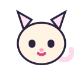
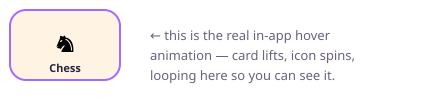
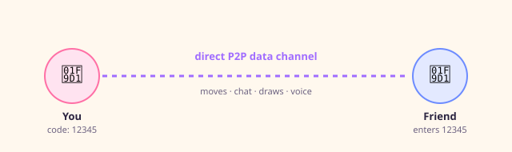

<div align="center">


<br>

<a href="#">
  
</a>

<br><br>


<br>

<sub>Peer‑to‑peer · no signup · no server storage · close the tab and the room is gone</sub>

<br><br>


</div>

<br>

## 🐈 Meet the mascot

<table>
<tr>
<td width="160" align="center">

</td>
<td valign="middle">

That's the header‑bar mascot, redrawn here with its actual idle motion — tail sways, ears twitch, and it blinks on a loop, exactly like it does live in the app. Tap the real one in‑app and it winks; leave it alone and it occasionally strikes a hidden pose (hearts, flowers) before settling back down.

</td>
</tr>
</table>

<br>

## 🕹️ What this actually is

Open the file. A **5‑digit room code** appears. Send it to someone — text it, call it out, whatever. They type it in, their browser dials yours directly over **WebRTC**, and a moment later you're both looking at the same board.

No account system, because there are no accounts. No matchmaking server, because there's no server — the two browsers just talk to each other. Refresh the tab and the game is gone, exactly like a real board game left on a real table.

It's one `.html` file. Markup, styling, six full game engines, a P2P sync layer, synthesized sound effects, and this cat, all in one file — no build step, no bundler, nothing standing between you and the source.

<br>


## 🎲 The games

<div align="center">

| | Game | What makes it worth playing |
|:---:|:---|:---|
| ♞ | **Chess** | Hand‑written rules engine, inlined — check, checkmate, castling, en passant, promotion, threefold repetition, all implemented from scratch. Configurable clocks (5 min / 10 min / 3+2 / no limit / custom). Works **fully offline** once loaded. |
| ✕ | **Tic‑Tac‑Toe** | Instant, zero ceremony — perfect for the 30 seconds before a call starts. |
| 🔴 | **Connect 4** | Classic gravity‑drop board, live piece animations synced both ways. |
| ⛃ | **Checkers** | Forced captures, kinged pieces, full board sync. |
| ⬤ | **Reversi** | Pieces visually flip mid‑spin as they change color when captured. |
| 🎨 | **Whiteboard** | Not a game — a shared live canvas. Pick a color, pick a brush, draw; strokes appear on the other screen point‑by‑point, correctly scaled even across mismatched screen sizes. |

</div>

Every one of these speaks the same tiny internal protocol — `init`, `render`, `onData` — registered under a shared `GameControllers` object. One consistent pattern, six games.

<br>

<div align="center">

<br><sub>The actual card‑lift + icon‑spin hover effect from the game picker, looping here so you can see it without opening the app.</sub>
</div>

<br>


## ✨ Beyond the boards

<table>
<tr><td width="50%" valign="top">

**🀄 Pass‑and‑play**
No second device needed — hand the phone across the table.

**🤝 Rematch / draw / resign**
Proper end‑of‑game flow with confirmation dialogs.

**🏆 Session scoreboard**
Wins, losses, and draws tracked across a whole sitting.

**📶 Live connection status**
A status pill + ping display, with automatic reconnect on drop.

</td><td width="50%" valign="top">

**💬 In‑room chat**
Slide‑out drawer, quick‑send presets, free typing.

**🎙️ Optional voice call**
A mic toggle riding the same peer connection.

**🎨 Board themes**
Re‑skin the board without leaving the game.

**🎵 Cozy background music**
In‑app picker that remembers your last track.

</td></tr>
</table>

<div align="center">

**🔊 Zero audio files.** Every move, capture, check, and connect chime is a **Web Audio oscillator synthesized live** — sine, square, sawtooth — including a two‑note pitch‑bent "chirp" when your opponent connects. Nothing to download, nothing to buffer.

</div>

<br>


## 🚀 Getting it running

No install step. No `npm install`. One file.

```bash
git clone https://github.com/your-username/twoplay.git
cd twoplay

open working-mainwebsite.html        # macOS
start working-mainwebsite.html       # Windows
xdg-open working-mainwebsite.html    # Linux
```

Prefer serving over `http://` instead of `file://`:

```bash
python3 -m http.server 8000
# → http://localhost:8000
```

Deploy it anywhere static — **GitHub Pages**, **Netlify**, **Vercel**, **Cloudflare Pages**. It's a static page. Nothing runs server‑side, ever.

<br>

## 🔗 How a room actually connects

<div align="center">

</div>

The 5‑digit code comes from the browser's own PeerJS identity and stays **stable across reconnects** — if the connection blips, the same code still works, instead of silently changing underneath you. Every move, chat line, and whiteboard stroke rides that one channel, batched and debounced so play stays smooth even on a shaky connection.

<br>


## 🧱 What's under the hood

| Layer | Approach |
|---|---|
| 🌐 **Networking** | [PeerJS](https://peerjs.com/) over WebRTC — a direct browser‑to‑browser data channel |
| ♟️ **Chess rules** | Hand‑written, dependency‑free engine inlined in the page — offline‑capable |
| 🎨 **Rendering** | Vanilla JavaScript + CSS — no framework, no virtual DOM, no bundler |
| 🔊 **Audio** | Web Audio API oscillators, synthesized on the fly — zero audio assets |
| 💾 **Persistence** | `localStorage` only, only for local prefs — sound, board theme, music track. Game state itself is never stored |
| 🔤 **Fonts** | `Baloo 2` display · `Nunito` body · `JetBrains Mono` codes, clocks, move list |

<br>

## 🎨 The visual language

<div align="center">
<table>
<tr>
<td align="center" width="70"><br><sub><code>#FFF8EE</code></sub><br><sub>bg</sub></td>
<td align="center" width="70"><br><sub><code>#FFFFFF</code></sub><br><sub>surface</sub></td>
<td align="center" width="70"><br><sub><code>#FF6FA5</code></sub><br><sub>accent</sub></td>
<td align="center" width="70"><br><sub><code>#A06CFF</code></sub><br><sub>chess</sub></td>
<td align="center" width="70"><br><sub><code>#6C8BFF</code></sub><br><sub>ttt</sub></td>
<td align="center" width="70"><br><sub><code>#FFB43D</code></sub><br><sub>c4</sub></td>
<td align="center" width="70"><br><sub><code>#2FBF83</code></sub><br><sub>reversi</sub></td>
<td align="center" width="70"><br><sub><code>#FF5C7A</code></sub><br><sub>checkers</sub></td>
</tr>
</table>
</div>

A warm "candy shop" palette — cream base, ink text, one signature color per game — with no dark mode by design. The shape language is **wobbly, hand‑rounded blobs** instead of uniform `border-radius`, and shadows are solid offset blocks ("sticker shadows") instead of blurred drop shadows, which is most of why the whole UI reads as tactile rather than flat.

```css
:root {
  --bg: #FFF8EE;  --surface: #FFFFFF;  --text: #2B2440;  --accent: #FF6FA5;

  --g-chess: #A06CFF;  --g-ttt: #6C8BFF;  --g-c4: #FFB43D;
  --g-chk:   #FF5C7A;  --g-rev: #2FBF83;  --g-wb: #FF8FC0;

  --blob-lg: 32px 24px 36px 20px;              /* wobbly, hand-rounded */
  --shadow-lift: 5px 6px 0 rgba(43,36,64,0.14); /* solid, not blurred  */
}
```

One variable block, and the entire look cascades from it — re‑skin the app by editing `:root`.

<br>


## 📁 Repository layout

```
twoplay/
├── working-mainwebsite.html   ← everything: markup, styles, six game
│                                  engines, P2P sync layer, audio, all of it
└── assets/                    ← animated SVGs used by this README
    ├── mascot.svg
    ├── pick-card-demo.svg
    └── connection-flow.svg
```

The app itself is one file, on purpose — trivially portable, at the cost of some scrolling. The `GameControllers` registry near the bottom of the `<script>` is the map: search `GameControllers.<name>` to find or add a game.

<br>

## 🤝 Contributing

1. Find the matching `GameControllers.<name> = { ... }` block.
2. Match the existing shape — `init`, `render`, `onData`, plus `statusText()` / `canTakeback()` where relevant.
3. Adding a new game? Add it to the `GAMES` config object and the shared UI (pick grid, switcher, local mode) picks it up automatically.

<br>

## 📄 License

MIT — take it, fork it, re‑skin it, ship it.

<br>

<div align="center">


<br>


</div>
